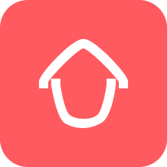

# Coloc'App - Shared Living Management Application

<div align="center">
  
  
  [](https://flutter.dev)
  [](https://firebase.google.com)
  [](https://dart.dev)
  [](https://github.com/LaithMahdi/darna-app)
</div>

## 📖 Overview

**Coloc'App** is a mobile application designed to simplify and organize shared living for roommates. The application provides a centralized digital platform that helps users manage daily tasks, track shared expenses, communicate efficiently, and store important documents related to their colocation.

Living in a shared home often leads to challenges such as poor task distribution, unclear expense tracking, and communication issues. Coloc'App addresses these problems by offering structured tools that promote transparency, responsibility, and collaboration among roommates.

## ✨ Key Features

### 🏠 Colocation Management

- Create or join a colocation using an invitation code
- Manage colocation members and settings
- View member list and their roles

### ✅ Task Management

- Create and assign household tasks to members
- Track task status (Pending, Completed, Rejected)
- View personal assigned tasks
- Mark tasks as completed

### 💰 Expense Tracking

- Add shared expenses with detailed information
- Automatic balance calculation per member
- View all expenses and expense details
- Track personal balance
- Split expenses equally or by custom amounts

### 💬 Real-Time Communication

- Internal chat room for all colocation members
- Send and receive messages instantly
- View chat history

### 📅 Calendar & Events

- Manage shared events
- View upcoming activities
- Coordinate schedules with roommates

### 📄 Document Management

- Upload important documents (rental contracts, bills, etc.)
- Securely store and access shared documents
- Validate important documents

## 👥 User Roles

The system includes two main roles:

### 🔑 Admin (Référent/Owner)

- Create and delete colocation
- Generate invite codes for new members
- Remove members from colocation
- Delete tasks and expenses
- Delete documents
- Modify task assignments
- Validate important expenses

### 👤 Member (Colocataire/User)

- Join colocation using invite code
- View colocation details
- Create and manage tasks
- Add and view expenses
- Send messages in chat
- Upload and view documents
- Update task status
- View personal assigned tasks
- View personal balance

## 🎨 Design

Access the complete UI/UX design on Figma:
[**Coloc'App Design**](https://www.figma.com/design/VzYG5ZaDnbgDahrqhKzNal/darna-app?node-id=0-1&t=mPRJU5V4Ss4DOi4V-1)

## 📊 Use Cases

### User & Owner Use Cases

The following diagram illustrates the different actions available for Users and Owners:


**User Actions:**

- Add expense
- View all expenses
- View expense details
- Create task
- Assign task to a member
- View tasks
- Update task status (mark completed)
- View personal assigned tasks
- Send messages
- View chat history
- Upload document
- View documents
- Complete profile (avatar, gender, etc.)
- Edit profile information
- Change language
- Change theme
- Enable/disable notifications
- Join colocation using invite code
- View colocation details
- View list of members
- Logout

**Owner Additional Actions:**

- Create colocation
- Generate invite code
- Remove member
- Delete colocation
- Validate important expenses
- Delete task
- Modify task assignment
- Delete expense
- Delete document

## 🗃️ Database Structure

The application uses Firebase Firestore with the following collections:


### Collections Overview

#### **users**

| Field              | Type            | Description               |
| ------------------ | --------------- | ------------------------- |
| id                 | UID             | Unique user identifier    |
| fullname           | string          | User's full name          |
| email              | string          | User's email address      |
| avatar             | string          | Profile picture URL       |
| gender             | MALE \| FEMALE  | User's gender             |
| role               | OWNER \| MEMBER | User's role in colocation |
| language           | EN \| FR \| AR  | Preferred language        |
| theme              | LIGHT \| DARK   | App theme preference      |
| notificationEnable | boolean         | Notification settings     |
| createdAt          | datetime        | Account creation date     |
| updatedAt          | datetime        | Last update timestamp     |

#### **colocations**

| Field        | Type     | Description           |
| ------------ | -------- | --------------------- |
| name         | string   | Colocation name       |
| inviteCode   | string   | Invitation code       |
| createdBy    | UID      | Creator's user ID     |
| membersCount | int      | Number of members     |
| createdAt    | datetime | Creation date         |
| updatedAt    | datetime | Last update timestamp |

#### **tasks**

| Field       | Type                             | Description           |
| ----------- | -------------------------------- | --------------------- |
| title       | string                           | Task title            |
| description | string                           | Task description      |
| assignedTo  | UID                              | Assigned member ID    |
| status      | PENDING \| COMPLETED \| REJECTED | Task status           |
| createdBy   | UID                              | Creator's user ID     |
| dueDate     | datetime                         | Task deadline         |
| createdAt   | datetime                         | Creation date         |
| updatedAt   | datetime                         | Last update timestamp |

#### **expenses**

| Field        | Type                             | Description           |
| ------------ | -------------------------------- | --------------------- |
| title        | string                           | Expense title         |
| amount       | double                           | Expense amount        |
| paidBy       | string                           | Member who paid       |
| participants | [UID]                            | Members involved      |
| splitType    | EQUAL \| CUSTOM                  | Split method          |
| status       | PENDING \| COMPLETED \| REJECTED | Expense status        |
| createdAt    | datetime                         | Creation date         |
| updatedAt    | datetime                         | Last update timestamp |

#### **rooms**

| Field             | Type     | Description            |
| ----------------- | -------- | ---------------------- |
| title             | string   | Room name              |
| participantsCount | int      | Number of participants |
| lastMessage       | string   | Last message preview   |
| participants      | [UID]    | List of participants   |
| broadcastId       | UID      | Broadcast identifier   |
| createdAt         | datetime | Creation date          |
| updatedAt         | datetime | Last update timestamp  |

#### **chatRoom**

| Field      | Type     | Description        |
| ---------- | -------- | ------------------ |
| senderId   | UID      | Sender's user ID   |
| receiverId | UID      | Receiver's user ID |
| message    | string   | Message content    |
| createdAt  | datetime | Send timestamp     |

#### **documents**

| Field      | Type     | Description        |
| ---------- | -------- | ------------------ |
| name       | string   | Document name      |
| fileUrl    | string   | File storage URL   |
| uploadedBy | UID      | Uploader's user ID |
| createdAt  | datetime | Upload date        |

## 🛠️ Tech Stack

### Frontend

- **Flutter** - Cross-platform mobile framework
- **Dart** - Programming language
- **Provider/Riverpod** - State management
- **go_router** - Navigation and routing

### Backend & Services

- **Firebase Authentication** - Secure user authentication
- **Cloud Firestore** - Real-time NoSQL database
- **Firebase Storage** - Document and file storage
- **Firebase Cloud Messaging** - Push notifications

### Architecture

- **Clean Architecture** - Separation of concerns
- **Repository Pattern** - Data abstraction layer
- **Service Locator** - Dependency injection

## 📱 Installation

### Prerequisites

- Flutter SDK (3.0 or higher)
- Dart SDK (3.0 or higher)
- Android Studio / Xcode
- Firebase account

### Steps

1. **Clone the repository**

```bash
git clone https://github.com/LaithMahdi/darna-app.git
cd darna-app
```

2. **Install dependencies**

```bash
flutter pub get
```

3. **Configure Firebase**
   - Create a new Firebase project
   - Add Android/iOS apps to your Firebase project
   - Download and add configuration files:
     - `google-services.json` for Android (to `android/app/`)
     - `GoogleService-Info.plist` for iOS (to `ios/Runner/`)

4. **Run the app**

```bash
flutter run
```

## 🚀 Build & Release

### Android

```bash
flutter build apk --release
# or
flutter build appbundle --release
```

### iOS

```bash
flutter build ios --release
```

## 📂 Project Structure

```
lib/
├── main.dart                 # Application entry point
├── core/                     # Core functionality
│   ├── config.dart          # App configuration
│   ├── constants/           # Constants (colors, styles, etc.)
│   ├── helper/              # Helper functions
│   ├── locator/             # Service locator setup
│   ├── providers/           # Global providers
│   └── service/             # Core services
├── features/                # Feature modules
│   ├── auth/               # Authentication
│   ├── onboarding/         # Onboarding screens
│   └── splash/             # Splash screen
├── routes/                 # Navigation routing
│   └── routes.dart
└── shared/                 # Shared widgets
    ├── buttons/
    ├── dots/
    └── spacer/
```

## 🤝 Contributing

Contributions are welcome! Please feel free to submit a Pull Request.

1. Fork the project
2. Create your feature branch (`git checkout -b feature/AmazingFeature`)
3. Commit your changes (`git commit -m 'Add some AmazingFeature'`)
4. Push to the branch (`git push origin feature/AmazingFeature`)
5. Open a Pull Request

## 📄 License

This project is licensed under the MIT License - see the [LICENSE](LICENSE) file for details.

## 👨‍💻 Author

**Mahdi**

## 📞 Support

For support, email support@colocapp.com or create an issue in this repository.

## 🙏 Acknowledgments

- Flutter team for the amazing framework
- Firebase for the comprehensive backend solution
- All contributors who help improve Coloc'App

---

<div align="center">
  Made with ❤️ for better shared living
</div>
