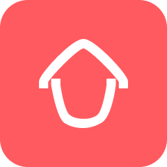

# Darna

<div align="center">
  

[Subscribe to my YouTube channel](https://www.youtube.com/@Laithmahdi-w6u)

[](https://flutter.dev)
[](https://firebase.google.com)
[](https://dart.dev)
[](LICENSE)

</div>

## Overview

Darna is a Flutter and Firebase application for managing shared living spaces. It helps roommates coordinate tasks, track shared expenses, communicate in real time, manage colocations, and keep shared information in one place.

The app follows MVVM architecture with a clean, feature-based structure, Riverpod state management, GoRouter navigation, and a reusable shared UI layer.

## Features

- Authentication with email/password and Google sign-in
- Onboarding, profile completion, and account management
- Create or join a colocation with invite codes
- View colocation members and shared details
- Create, assign, filter, and track household tasks
- Real-time chat and chat room support
- Notifications list with read and delete actions
- Settings, privacy, and help/support pages
- Shared widgets and UI components for consistent styling

## Tech Stack

### Frontend

- Flutter
- Dart
- Flutter Riverpod
- GoRouter

### Services

- Firebase Authentication
- Cloud Firestore
- Firebase Core
- Google Sign-In

### Supporting Packages

- GetIt for service location
- Shared Preferences for local persistence
- Cached Network Image for remote media
- Image Picker and Share Plus for native actions

## Project Structure

```
lib/
├── main.dart
├── core/
├── features/
│   ├── auth/
│   ├── chat/
│   ├── colocation/
│   ├── layout/
│   ├── notifications/
│   ├── onboarding/
│   ├── privacyAndTermsCondition/
│   ├── splash/
│   └── tasks/
├── routes/
└── shared/
```

## Getting Started

### Prerequisites

- Flutter SDK compatible with the version declared in `pubspec.yaml`
- Dart SDK compatible with the version declared in `pubspec.yaml`
- Firebase project access
- Android Studio, Xcode, or VS Code with Flutter support

### Setup

1. Clone the repository.

```bash
git clone https://github.com/LaithMahdi/darna-app.git
cd darna-app
```

2. Install dependencies.

```bash
flutter pub get
```

3. Configure Firebase.

- Ensure the generated Firebase configuration matches your project
- Place `google-services.json` in `android/app/`
- Place `GoogleService-Info.plist` in `ios/Runner/` if you are targeting iOS

4. Run the app.

```bash
flutter run
```

## Build

### Android

```bash
flutter build apk --release
flutter build appbundle --release
```

### iOS

```bash
flutter build ios --release
```

## Design Reference

The UI/UX direction is available in Figma:

[Darna Design](https://www.figma.com/design/VzYG5ZaDnbgDahrqhKzNal/darna-app?node-id=0-1&t=mPRJU5V4Ss4DOi4V-1)

## Notes

- This project uses Firebase collections for users, colocations, tasks, notifications, chat rooms, and messages.
- The app theme uses the Raleway font family and shared image assets from `assets/images/`.
- Privacy and terms content are stored in `assets/json/`.

## Contributing

Contributions are welcome. If you plan to contribute, open an issue first for larger changes so the scope stays aligned.

## License

This project is licensed under the MIT License. See [LICENSE](LICENSE) for details.

## Author

Laith Mahdi
